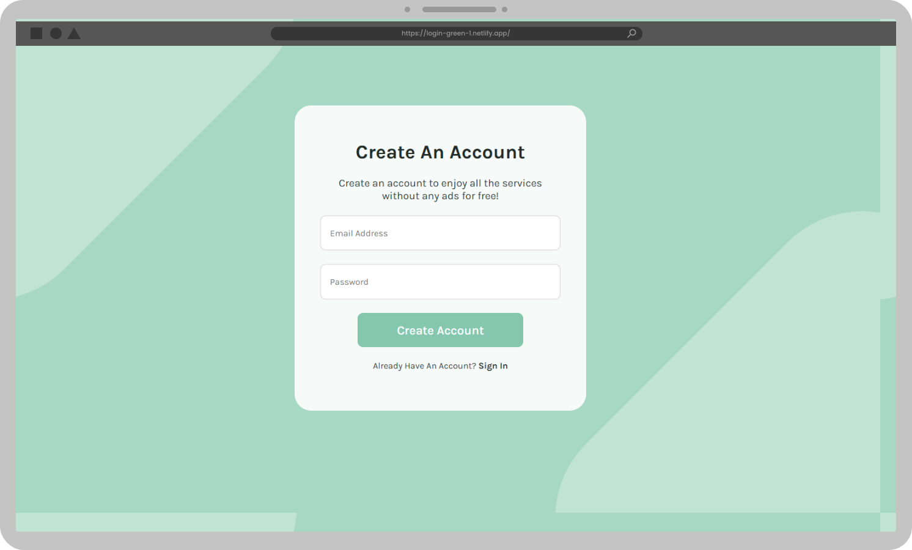

# Login Page Verde

Este é um projeto simples de uma página de login desenvolvida com HTML e CSS. O design é minimalista, com foco em uma paleta de cores verde, que transmite frescor e confiança.

## 🎯 Objetivo
Criar uma interface amigável e responsiva para prática e aprendizado de desenvolvimento front-end, utilizando apenas HTML e CSS.

## 🚀 Funcionalidades
- **Formulário de Login**: Inclui campos para nome de usuário (ou e-mail) e senha.
- **Botão de Login**: Botão estilizado para envio das informações.
- **Links adicionais**: Links para recuperação de senha e criação de uma nova conta.
- **Design Responsivo**: Adaptável a diferentes tamanhos de tela, incluindo dispositivos móveis e desktops.
- **Layout Moderno**: Fundo com formas suaves e tons harmoniosos para melhorar a experiência visual.

## 🛠️ Tecnologias Utilizadas
- **HTML5**: Estruturação da página.
- **CSS3**: Estilização e layout responsivo.

## 📂 Estrutura de Pastas
```
login-page/
├── index.html
├── style.css
├── img/
   ├── bg.svg
└── README.md
```

## 🎨 Paleta de Cores
- **Primária (verde):** Usada no fundo e nos elementos principais.
- **Secundária:** Tons neutros para contraste, como branco e cinza.

## 💻 Como Utilizar
1. Clone o repositório:
   ```bash
   git clone https://github.com/seu-usuario/login-page-verde.git
   ```
2. Abra o arquivo `index.html` no navegador.

## 🌟 Melhorias Futuras
- Adicionar validação de formulário com JavaScript.
- Integrar com uma API para autenticação real.
- Melhorar a acessibilidade (A11y).

## 📜 Licença
Este projeto está sob a licença MIT. Sinta-se à vontade para utilizá-lo e modificá-lo conforme necessário.

---



<a href="https://login-green-1.netlify.app/">Acessar Projeto</a>

Feito por Bernardo Lopes.
